# Robotic Assistant for Laparoscopic Surgery

A simulation of a two-arm robot that assists a surgeon during laparoscopic
(keyhole) gynaecological surgery. A **YOLO26-seg** model watches the real
surgical video, finds the instruments and the critical structures (ureter,
obturator nerve, iliac artery and vein), and drives two simulated robot arms.
The surgeon controls the robot by **voice** ("Ana zoom in") or keyboard, and a
safety layer warns before an instrument gets too close to a critical structure.

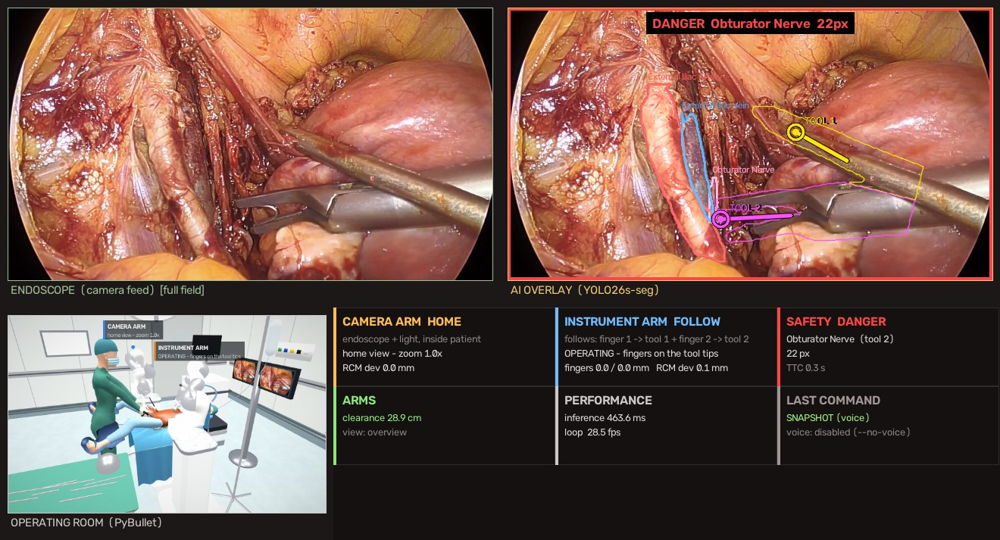

<p align="center"><i>Surgeon console: camera feed, YOLO26 AI overlay with a DANGER warning, the 3D operating room and the robot status.</i></p>

> This is a research / student project and a kinematic simulation. It is not
> a medical device: no tissue physics, no force feedback, and safety distances
> are measured in image pixels.

---

## What it does

| Part | What it does |
|---|---|
| **Perception** | YOLO26s-seg (8 classes) on every video frame: instruments, ureter, obturator nerve, external iliac artery and vein, uterine artery, uterus, ovary. Tracks up to two tools (TOOL 1 / TOOL 2) with tip and shaft direction. |
| **Arm 1 - camera arm** | Holds the endoscope and light inside the patient through its port (trocar). Zooms, pans, centres and follows the tool on voice command. |
| **Arm 2 - instrument arm** | One arm with two fingers; each fingertip follows one tool tip from the video. |
| **Safety** | Distance and time-to-contact warnings (CLEAR / WARN / DANGER) to critical structures; both arms always stay inside the patient and pivot exactly at their port (RCM); arm-to-arm clearance guard. |
| **Voice** | Offline speech recognition (Vosk), wake word **"Ana"**, short fixed command list, beep on every accepted command. |
| **Operating room 3D view** | Realistic theatre: surgeon, patient in low lithotomy, two KUKA-style arms, monitors showing the live feed and the AI overlay. 13 camera angles and a free, zoomable 3D window. |

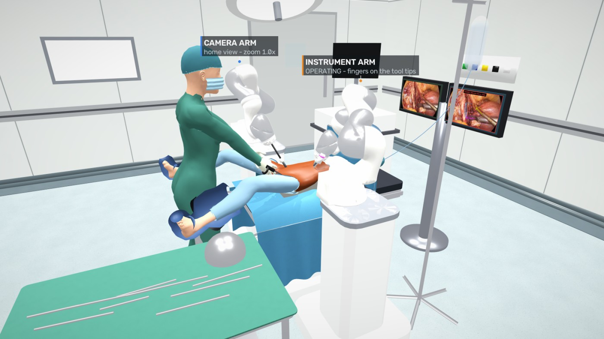

More screenshots: [Gallery](#gallery).

---

## Quick start (Windows, NVIDIA GPU)

```bash
# 1. Python 3.10 or 3.11, then PyTorch with CUDA FIRST
python -m pip install torch torchvision --index-url https://download.pytorch.org/whl/cu124

# 2. everything else
python -m pip install -r requirements.txt

# 3. check the GPU is used (must print True)
python -c "import torch; print(torch.cuda.is_available())"
```

Put these files in place (they are not in the repository - see
[What is not in the repo](#what-is-not-in-the-repo)):

```
weights/best.pt          trained YOLO26-seg weights
data/case01.avi          a laparoscopic video (any .mp4 / .avi works with --video)
models/vosk-small-en/    voice model: vosk-model-small-en-us-0.15 from
                         https://alphacephei.com/vosk/models (unzip and rename)
assets/                  human models for the 3D room: python tools/get_assets.py
```

Run:

```bash
python main.py --show-sim                  # full console + 3D operating room + voice
python main.py --show-sim --or-window      # also open the big zoomable 3D window
python main.py --show-sim --no-voice       # without the microphone
python main.py --video data/my_clip.mp4 --show-sim
```

---

## All commands

### Voice

Say the wake word **"Ana"** (pronounced *AH-nuh*) first, with a short pause
before it: *"Ana, zoom in"*. Only **"stop"** works on its own, at any time.
Every accepted command beeps and appears in the LAST COMMAND tile; the voice
tile shows what was heard.

| Say | Key | What happens |
|---|---|---|
| **Camera arm** | | *(changes the right screen = AI overlay; the left screen always shows the untouched camera feed)* |
| Ana zoom in / Ana closer | `=` | zoom in (the scope goes deeper) |
| Ana zoom out / Ana wider | `-` | zoom out |
| Ana left / Ana right | `a` / `d` | move the view one step left / right |
| Ana up / Ana lower (or down) | `w` / `x` | move the view one step up / down |
| Ana centre | `c` | put the active tool in the middle |
| Ana follow | `f` | keep the active tool in the middle automatically |
| Ana freeze (or hold) | `h` | camera stops moving |
| Ana reset (or home) | `g` | back to the start view |
| Ana light up / Ana brighter | `l` | brighter picture |
| Ana light down / Ana darker / Ana dimmer | `k` | darker picture |
| **Instrument arm** | | |
| Ana tool follow | `1` | arm 2 follows the tools |
| Ana tool hold | `2` | arm 2 stays still |
| **Safety and records** | | |
| **stop** | `z` | **both arms freeze immediately** (say "Ana tool follow" to restart arm 2) |
| Ana picture | `s` | save a screenshot to `runs/shot_*.png` |
| Ana mark | `m` | save a time mark to `runs/marks_<tag>.csv` |

Voice can never push an arm into a danger zone or out of the patient, and
YOLO + safety always check the **full** video even when the view is zoomed.

### Keyboard only

| Key | What happens |
|---|---|
| `space` | pause / resume |
| `q` | quit |
| `v` / `b` | next / previous operating-room camera angle |
| `r` | back to the current angle |
| `o` | open / close the big 3D operating-room window |

### Big 3D window (`o` or `--or-window`)

| Mouse / key | What happens |
|---|---|
| left-drag | orbit around the scene (floor stays level) |
| right-drag (or Shift + left-drag) | pan |
| mouse wheel | smooth zoom |
| `v` / `b` | next / previous angle (the camera glides there) |
| `r` | back to the current angle |
| `Esc` / close button | close (press `o` in the console to reopen) |

Camera angles: overview, over the shoulder, ports close-up, surgeon's view,
head end, anaesthetist, camera arm, instrument arm, left side, right side,
top down, whole room, monitors.

### Command-line options

| Option | Meaning |
|---|---|
| `--show-sim` | show the 3D operating room in the console |
| `--or-window` | open the big 3D window at start |
| `--video PATH` | use another video |
| `--model PATH` | use other YOLO weights |
| `--no-voice` | keyboard only |
| `--record runs/demo.mp4` | save the console as a video |
| `--seconds N` / `--once` | stop after N seconds / at the end of the video |
| `--tag NAME` | name of this run's CSV files in `runs/` |
| `--demo` | synthetic target instead of the model (quick scene check) |
| `--headless` | no windows (metrics only) |
| `--drop P` / `--jitter PX` | robustness experiments: drop detections / add noise |
| `--bullet-window` | also open PyBullet's own debug window |

---

## Checking that everything works

```bash
python selftest.py          # ~40 checks: kinematics, control, safety, voice, your model + video
python check_or_panel.py    # 3D renderer: packages, GPU, draw time
python voice_test.py        # a computer voice says every command; all should PASS
python voice_test.py --mic  # you speak; shows what was heard
```

At the end of every run the console prints a short **performance report**
(loop fps, YOLO time, GPU clock / temperature) and saves `runs/perf_<tag>.csv`.

## Settings (`config.py`)

| Setting | Default | Meaning |
|---|---|---|
| `IMGSZ`, `CONF_PER_CLASS` | 768, tuned | YOLO input size and per-class thresholds |
| `VOICE_WAKE_WORD` | `"ana"` | wake word (`""` = no wake word) |
| `VOICE_BEEP` | `True` | beep when a command is accepted |
| `OR_QUALITY` | `"medium"` | 3D room quality: `low` / `medium` / `high` |
| `OR_VIEWS` | 13 angles | camera angles for `v` / `b` |
| `OR_WINDOW_SIZE`, `OR_WINDOW_FPS` | 1280x720, 60 | big 3D window |
| `VIDEO_REALTIME` | `True` | play the video at its real speed (keeps the GPU cool) |
| `INSTRUMENT_FIXTURE` | `False` | arm 2 refuses to move closer to a structure in the danger zone |

If it feels slow: use `OR_QUALITY = "low"`, keep the laptop plugged in, set
Windows power mode to *Best performance*, and in the NVIDIA Control Panel set
`python.exe` to *Prefer maximum performance*.

---

## Project structure

```
main.py              start here: video -> YOLO -> control -> console
config.py            all settings
perception.py        YOLO26-seg, tool tracking, tip / shaft estimation
tool_axis.py         instrument axis from the mask
endoscope.py         virtual endoscope (view of the recorded frame)
camera_model.py      fixed camera model: pixel <-> 3D point on the tissue
camview.py           voice camera: zoom / pan / centre / follow / light
control.py           instrument arm (two fingers), safety layer, guards
rcm.py               remote-centre-of-motion kinematics (port pivot)
scene.py             PyBullet scene, two KUKA iiwa arms, IK
commands.py          command list, wake word, keyboard map
voice.py             offline voice listener (Vosk)
display.py           surgeon console layout
or_render.py         realistic 3D operating room (pyrender) + panel process
or_viewer.py         big zoomable 3D window (own process)
fastgl.py            speed patches for pyrender
humans.py, props.py  surgeon, patient, room and equipment models
orcam.py             camera presets for the 3D room
perfmon.py           performance log and slowdown report
selftest.py          automatic checks (PASS / WARN / FAIL)
check_or_panel.py    3D renderer check
voice_test.py        voice recognition check
analyze.py           results tables / figures from runs/metrics_*.csv
retrain_instruments.py   helpers to fix labels and fine-tune the model
tools/get_assets.py  downloads the CC0 human models
assets/              human models, textures, licences
docs/                screenshots and detailed technical notes
```

More detail on the design, tests and experiments:
[docs/TECHNICAL_NOTES.md](docs/TECHNICAL_NOTES.md).

## What is not in the repo

Large or private files are excluded by `.gitignore`:

* `data/` - surgical videos (too large, and patient data)
* `models/` - the Vosk voice model (download link above)
* `runs/` - outputs of your runs
* `weights/*.onnx`, `*.engine` - exported model files

`weights/best.pt` (about 23 MB) **is** uploaded, so the project runs after
cloning. If the model must stay private, delete the line `!weights/best.pt`
in `.gitignore` before your first commit.

## Gallery

All screenshots are in [`docs/images/`](docs/images).

### Surgeon console

| Danger warning | Warning (approaching) |
|---|---|
|  | 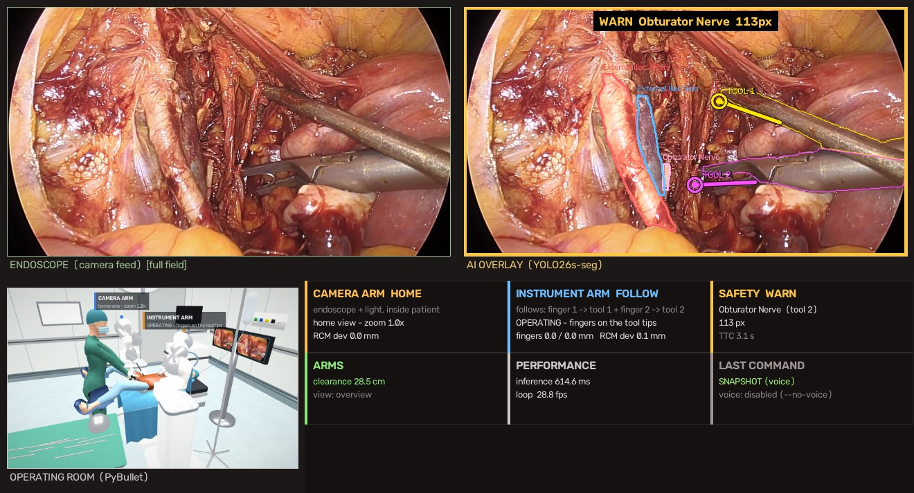 |

| Voice: "Ana zoom in" + "Ana light up" (right screen only) | Voice: "Ana light down / up" |
|---|---|
| 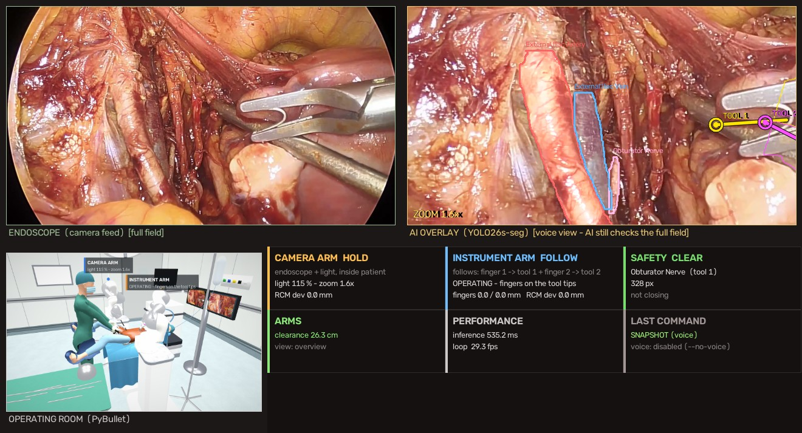 | 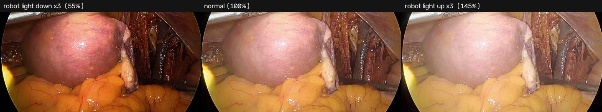 |

### 3D operating room

| Overview | Big zoomable 3D window (`o`) |
|---|---|
|  | 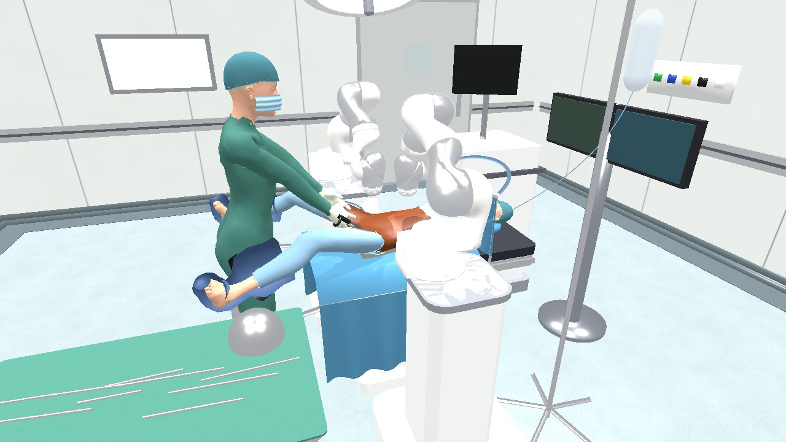 |

| Instrument arm with two instruments (TOOL 1 / TOOL 2) | Ports close-up |
|---|---|
| 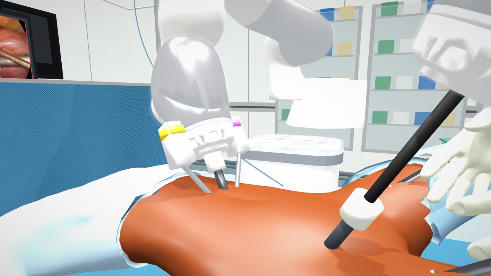 | 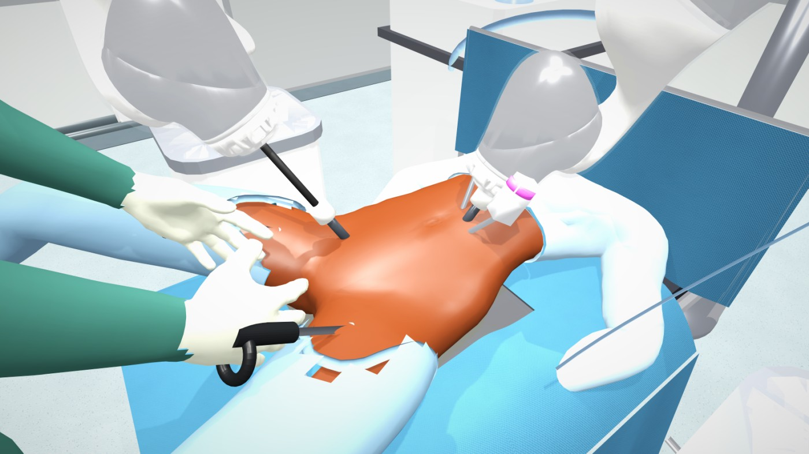 |

| Theatre monitors: camera feed + YOLO26 overlay | Head end (anaesthetist side) |
|---|---|
| 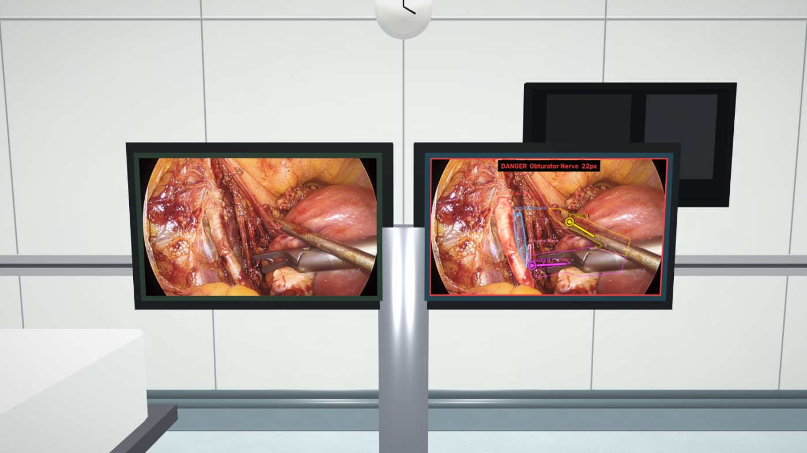 | 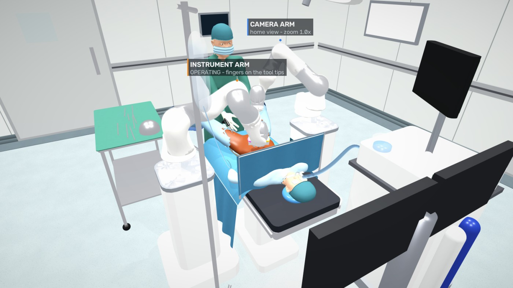 |

| Surgeon's view | Whole room |
|---|---|
| 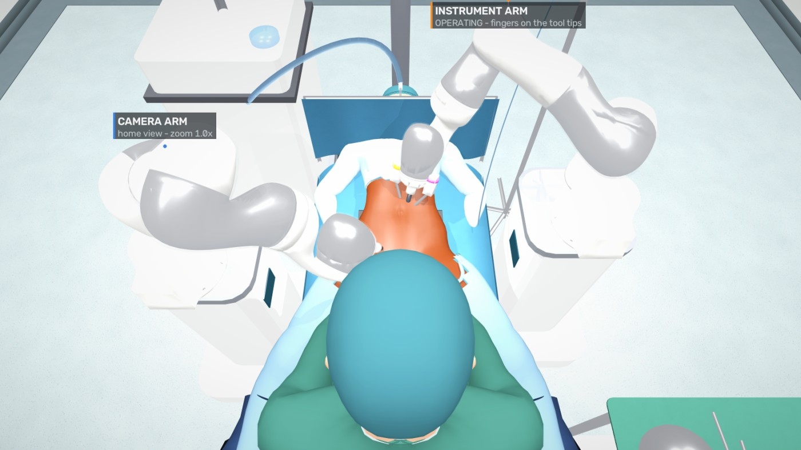 | 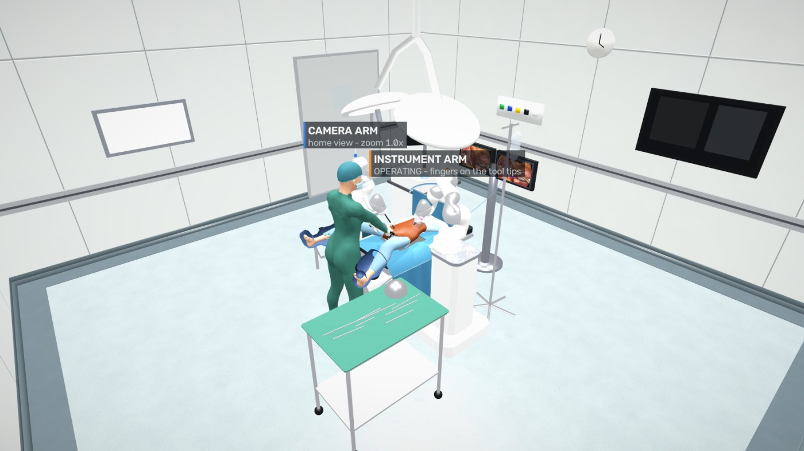 |

### All camera angles

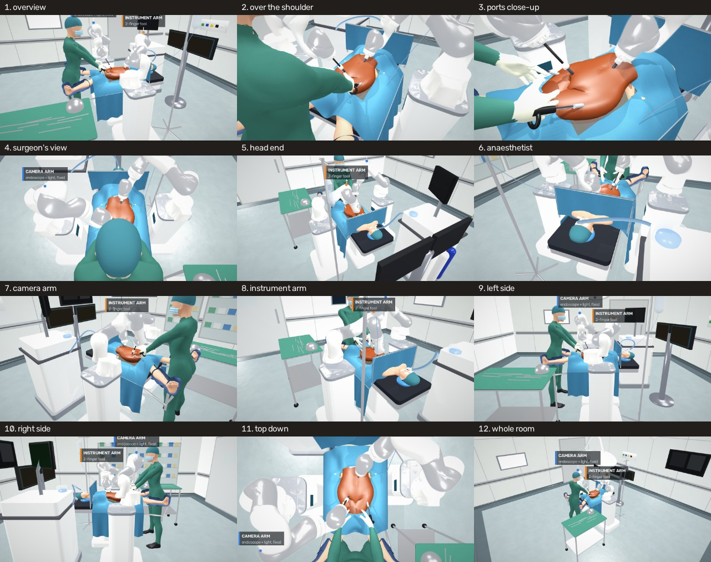

### Before and after (simple PyBullet view vs. realistic renderer)

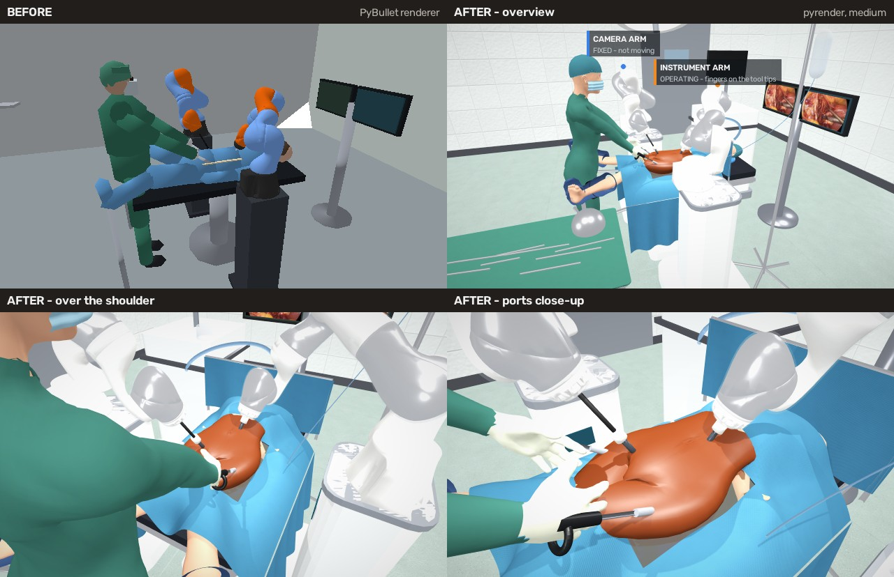

> Screenshots were made on a test machine without a GPU, so the PERFORMANCE
> tile shows slow inference there; on an RTX laptop it is about 20 ms.

## Credits

* Human models: [MakeHuman](http://www.makehumancommunity.org/) system assets,
  CC0 - see `assets/LICENSES.md`. Room textures are generated in code.
* YOLO: [Ultralytics](https://github.com/ultralytics/ultralytics) (AGPL-3.0).
* Speech: [Vosk](https://alphacephei.com/vosk/) (Apache-2.0).
* Rendering: [pyrender](https://github.com/mmatl/pyrender), physics:
  [PyBullet](https://pybullet.org/).

## Team

B.Tech CSE project, School of Computer Science and Engineering, VIT Chennai.
Guide: Nisha V.M.

* Ayush Dwivedi - YOLO segmentation model
* Priyesh Kumar Jha - data augmentation / ML
* Shivansh Arora - robotic arm simulation
